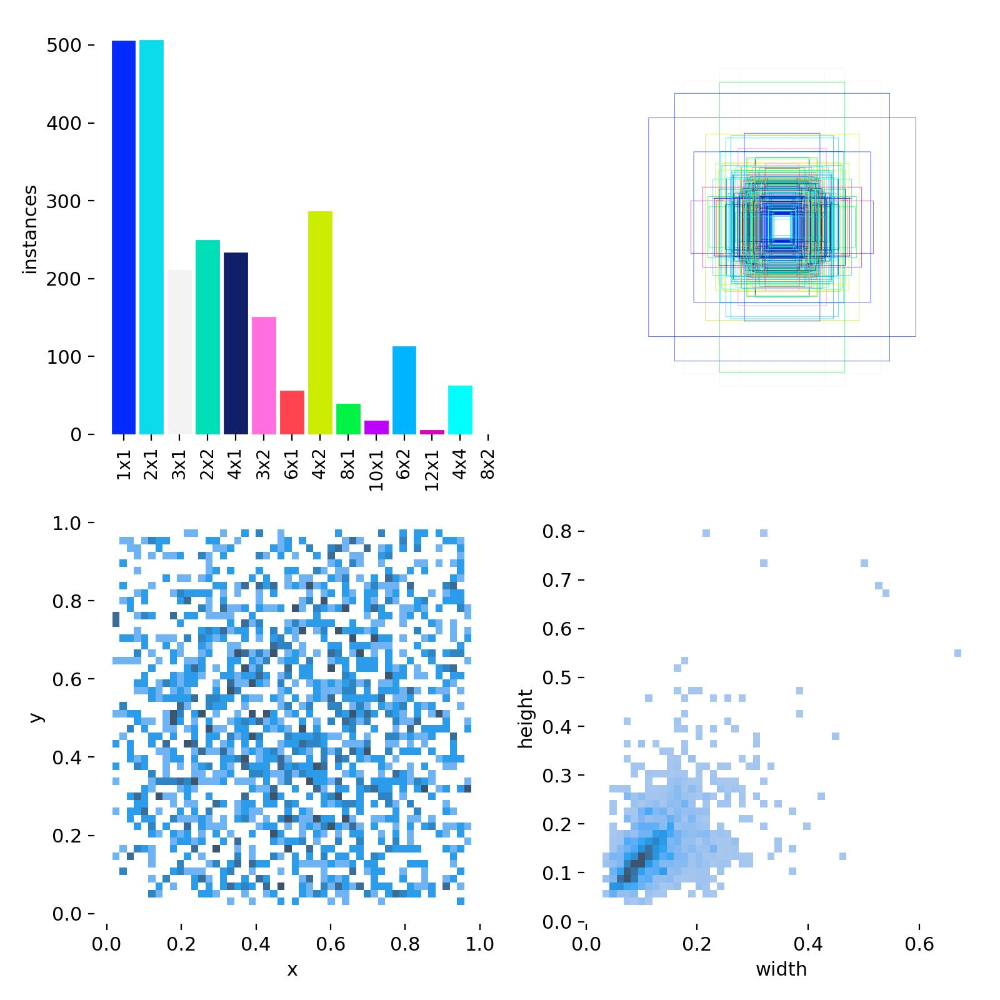
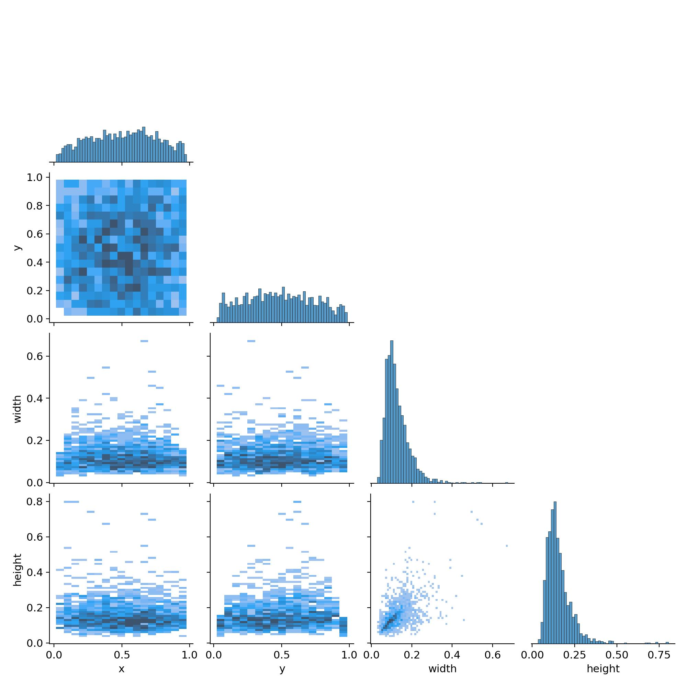

# Análisis de Entrenamiento Multiclase YOLO

## Introducción
Este informe analiza los resultados de una sesión de entrenamiento multicategoría utilizando YOLO. Se evalúan las distribuciones de cajas delimitadoras, la correlación entre las dimensiones de los objetos detectados y posibles problemas de balance de clases. El análisis de estas visualizaciones proporciona información sobre la calidad del dataset y su impacto en el modelo.

## Distribución de Posiciones (x, y)

- Los objetos se encuentran distribuidos de manera dispersa en la imagen.
- No se observa un sesgo extremo hacia los bordes o esquinas, lo que es favorable para la generalización del modelo.
- En caso de concentraciones anómalas en ciertas regiones, podría indicar patrones en la captura de datos.

## Distribución de Tamaños (width, height)

- Predominan los objetos pequeños, con una menor representación de objetos de gran tamaño.
- Existe una correlación positiva entre el ancho y la altura de las cajas delimitadoras, lo que es esperado.
- Para mejorar la detección de objetos de tamaño reducido, podría considerarse la aplicación de técnicas de aumento de datos (augmentations).

## Análisis de Anclas y Agrupación
- El diagrama de anclas muestra la distribución de cajas utilizadas por el modelo.
- Se recomienda verificar si los anclajes generados coinciden con los tamaños de los objetos presentes en el dataset.
- Si hay redundancia en los anclajes o estos no reflejan las dimensiones reales de los objetos, se podría reoptimizar su agrupación.

## Desbalance de Clases y Tamaños
- El histograma de frecuencia de tamaños muestra una clara predominancia de ciertos formatos sobre otros.
- En tareas de clasificación multiclase, los desbalances pueden afectar el rendimiento del modelo.
- Podría considerarse la generación de datos sintéticos o el aumento de datos para mejorar la representación de clases minoritarias.

## Métricas Óptimas Alcanzadas
- Precisión máxima (mAP50-95): 72.15% (epoch 32)
- Precisión máxima por clase (metrics/precision): 79.40% (epoch 31)
- Mejor recall: 92.20% (epoch 1)
- mAP50 más alto: 78.74% (epoch 35)
- Pérdidas mínimas:
  * Box loss: 0.50759 (epoch 32)
  * Classification loss: 0.82204 (epoch 37)
  * DFL loss: 0.86413 (epoch 33)

Estos resultados indican un buen rendimiento general del modelo, especialmente en términos de precisión media (mAP), aunque hay margen de mejora en el balance entre precisión y recall.

## Conclusiones y Recomendaciones
- Se cuenta con una distribución amplia de coordenadas y dimensiones, lo que favorece la generalización del modelo.
- La correlación entre anchura y altura es esperada, pero se debe revisar si los anclajes reflejan correctamente las características del dataset.
- Un desbalance en el número de instancias por clase podría impactar el rendimiento del modelo.
- Se recomienda evaluar el desempeño con métricas como mAP, precisión y recall por clase, y realizar ajustes según los resultados obtenidos.

Este análisis proporciona una base sólida para futuras iteraciones y optimizaciones en el entrenamiento del modelo.

